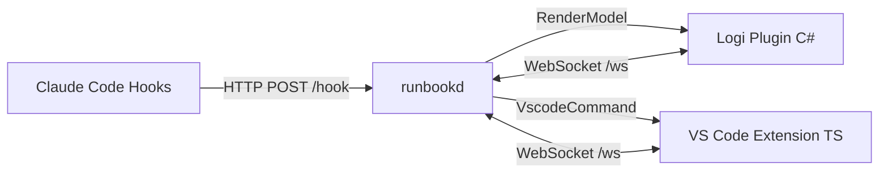

# Runbook Architecture

> This document is the single source of truth for architectural decisions in the Runbook system.
> If the code disagrees with this doc, one of them needs to change.

## System overview

Runbook is a **physical control surface for the Claude Code agent loop**. It consists of four components communicating over a stable versioned protocol:



The daemon (`runbookd`) is the brain. Everything else is an I/O adapter.

## Truth boundaries

The system has three distinct sources of truth. **Never conflate them.**

### A) Hook truth (Claude Code lifecycle)

Source: Claude Code hook events forwarded by `runbook-hooks`.

**Only** hook events may set these `AgentState` values:

| State | Hook source |
|-------|-------------|
| `Idle` | `Notification/idle_prompt` |
| `Running` | `UserPromptSubmit`, `PreToolUse`, `PostToolUse` |
| `WaitingPermission` | `Notification/permission_prompt`, `PermissionRequest` |
| `WaitingInput` | `Notification/elicitation_dialog` |
| `Complete` | `TaskCompleted` |
| `Settled` | `Stop` |
| `Ended` | `SessionEnd` |
| `Blocked` | `RunbookPolicy/blocked` (our policy, not Claude lifecycle) |

**Rule:** Without hooks, the device MUST NOT display `Running`, `WaitingPermission`, `WaitingInput`, `Complete`, or `Settled`. Only `Unknown`, `Sent` (degraded dispatch), and `Ended` are allowed.

### B) Operator intent truth (always available)

Source: hardware input from the Logitech device.

- `armed`: which prompt is selected (keypad press)
- `page`: which keypad page is active
- `last_dispatched`: what was last sent

These are local state. They don't depend on hooks or VS Code.

### C) VS Code actuator truth (best-effort, observable)

Source: the VS Code extension's terminal list and focus state.

- `terminals[]`: ordered list with stable indices
- `active_terminal_index`: which terminal is focused
- `session_tag` per terminal (if launched via "Start Claude Session")

The daemon treats VS Code as the authority on "what terminals exist" but NOT on "what Claude is doing."

## Reducer discipline

Every state transition traces to exactly one event:

```
fn reduce(state: &mut DaemonState, config: &RunbookConfig, event: Event) -> Vec<SideEffect>
```

- **No side effects in the reducer.** Side effects (`BroadcastRender`, `SendVscodeCommand`) are returned as values and executed by the I/O layer.
- **No state reads outside the reducer.** Render model is built from `DaemonState` + `RunbookConfig` only.

## Degraded-mode rules

When `hooks_mode == Absent`:

- Agent state renders as `Unknown`
- Dispatching a prompt sets state to `Sent` (local truth: "we typed it")
- No `Running`/`WaitingPermission`/`Complete` — we can't know
- All keypad/dialpad/page functionality still works

When `hooks_mode == Active`:

- Full-fidelity state from hook events
- `Sent` is never used (hooks will confirm `Running`)

## Multi-session correlation strategy

### Problem

Claude Code can run in multiple terminals simultaneously. Each has a `session_id`. Without correlation, the device shows the wrong session's state.

### Solution: `RUNBOOK_SESSION_TAG`

1. VS Code extension launches Claude terminals with `env: { RUNBOOK_SESSION_TAG: <uuid> }`
2. `runbook-hooks` reads the env var and includes `session_tag` in forwarded events
3. VS Code extension reports `terminal_index ↔ session_tag` mapping to daemon
4. Daemon learns `session_tag ↔ session_id` from hook events

This gives: `roller_selection → terminal_index → session_tag → session_id → AgentState`

### Degraded behavior (no tags)

- Hooks still arrive with `session_id`
- But no mapping to terminal index
- UI shows `Unknown` for that terminal's agent state
- **No heuristics.** If we can't prove it, we don't display it.

### Multi-session rendering rules

| Live sessions | Behavior |
|---------------|----------|
| 0 | Show latched `last_ended_state`, then `Unknown` |
| 1 | Show that session's state |
| >1 (no tags) | `Unknown` (can't map terminal ↔ session) |
| >1 (with tags) | Show selected terminal's correlated session state |

## Locked decisions

### Dial scroll
- **Default:** OS-level scroll (Logi profile built-in, no daemon involvement)
- **Fallback:** `dial.mode: vscode_terminal_scroll` routes through daemon → VS Code

### Paging ownership
- **Daemon owns paging.** Logi plugin sends `page_nav` events; daemon decides what to render.
- Enables future per-repo auto-page switching.

### Prompt truth source
- **Claude plugin commands are canonical** in full-fidelity mode
- `fallback_text` is the degraded-mode dispatch path
- `PromptConfig::effective_command(is_claude)` resolves this at dispatch time
